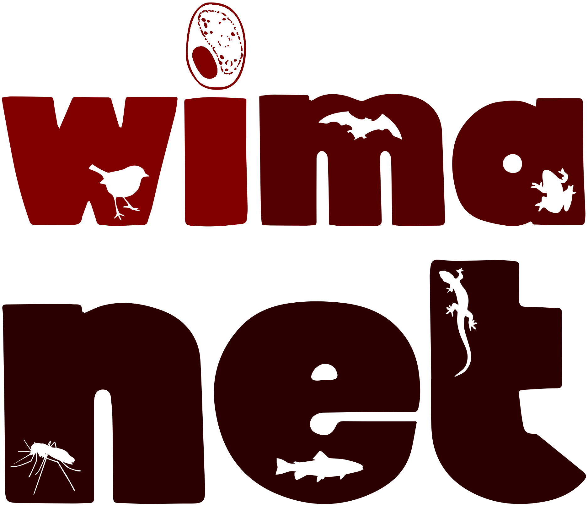
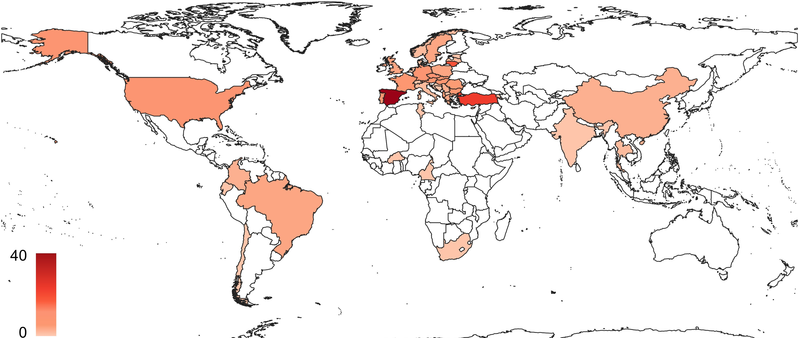

## Project description

### Background 

Vector-borne diseases, and emerging infectious diseases of wildlife, are major contributors to the global disease burden and of increasing concern globally. Haemosporidian parasites are ubiquitous in nature, hugely diverse, and associated with morbidity and mortality across taxa, including humans, livestock and wildlife. Many research groups globally focus on these parasites as model systems for addressing a broad range of ecological and evolutionary questions with economic and health implications. 
 

<iframe src="https://www.youtube.com/embed/zmbeq6P09CQ" frameborder="0" allowfullscreen></iframe>

 

### Aims

- This Action will bring together individuals and research groups to focus on coordinating research objectives to which multiple groups can contribute existing datasets, meaning that questions can be addressed at a global, rather than a local or regional, scale. Coordinating and sharing research efforts between groups offers huge potential for large-scale collaborative research initiatives. 
- This Action will promote the development of a common research agenda by providing opportunities for training, collaboration and knowledge exchange, targeting diverse researchers across disciplines to foster an interdisciplinary approach, whilst also recruiting and supporting a diversity of new researchers. 
- The Action will target stakeholders, policymakers and the general public to endorse knowledge transfer and maximise the reach of the network.
 
 

_Countries of origin of the members participating in WIMANET (from [https://doi.org/10.1016/j.ijppaw.2024.100989](https://doi.org/10.1016/j.ijppaw.2024.100989))._
 
 

### Groups

| #  | Working groups      | Lead  | Co-lead | 
| -----  | ----------- | ----------- | ----------- | 
| 1  | [Coordinating genomics, transcriptomics, and molecular markers](https://wimanet-science.github.io/web/wg1/)      | [Nayden Chakarov](https://wimanet-science.github.io/web/team/#Nayden+Chakarov)  | Luz Garcia-Longoria, Ricardo Jorge Lopes  |
| 2  | [Incorporating molecular markers and morphology to assign wildlife malaria lineages to species](https://wimanet-science.github.io/web/wg2/)   | [Melanie Duc](https://wimanet-science.github.io/web/team/#Melanie+Duc)  | Ravinder Sehgal |
| 3  | [Vector transmission success in wildlife malaria](https://wimanet-science.github.io/web/wg3/)     | [Josue Martinez-de la Puente](https://wimanet-science.github.io/web/team/#Josue+Martinez-de+la+Puente)  |  Carolina Chagas |
| 4  | [Impact of anthropogenic activities and wildlife malaria on host haematology](https://wimanet-science.github.io/web/wg4/)   | [Swen Renner](https://wimanet-science.github.io/web/team/#Swen+Renner)  | Diego Santiago |
| 5  | [Drivers of spatiotemporal variation in multi-host-parasite communities](https://wimanet-science.github.io/web/wg5/)      | [Kasun Bodawatta](https://wimanet-science.github.io/web/team/#Kasun+H.+Bodawatta)  | Daliborka Stankovic |
| 6  | [Coordinating and implementing the CBOs](https://wimanet-science.github.io/web/wg6/)   | [Martina Ferraguti](https://wimanet-science.github.io/web/team/#Martina+Ferraguti)  | Rafael Gutierrez |
