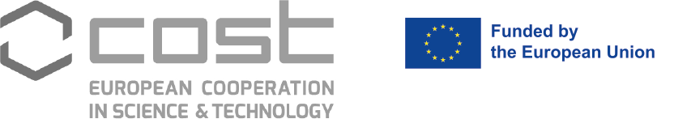

## Welcome to the website of the COST Action WIMANET: 
  
)
  
COST (European Cooperation in Science and Technology) is a funding agency for research and innovation networks. 
Our Actions help connect research initiatives across Europe and enable scientists to grow their ideas by sharing them with their peers. 
This boosts their research, career and innovation. 
[www.cost.eu](www.cost.eu).
  

## Latest activities in the project:
