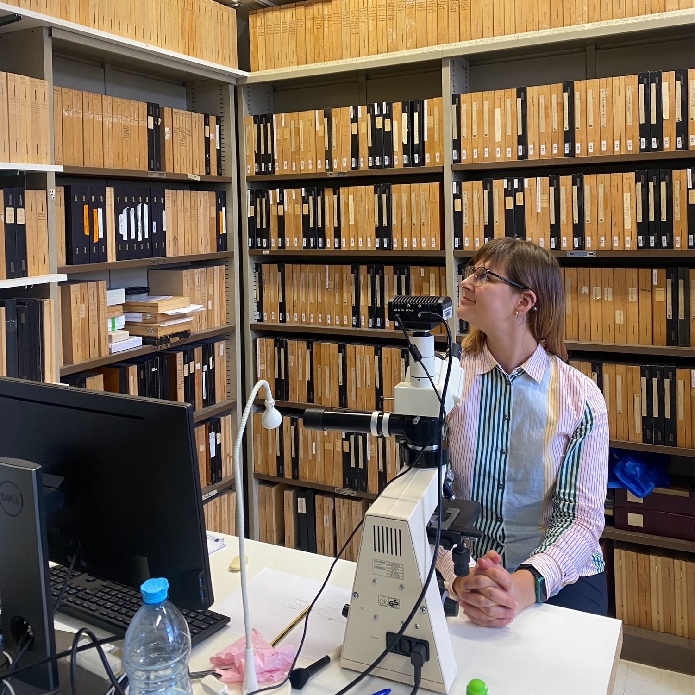
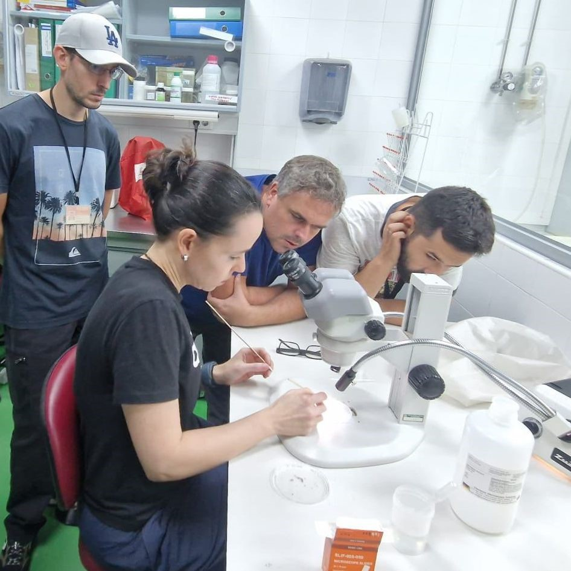
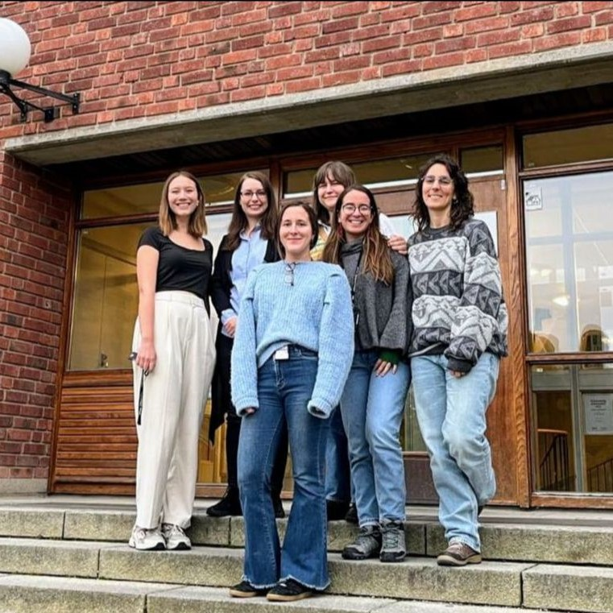
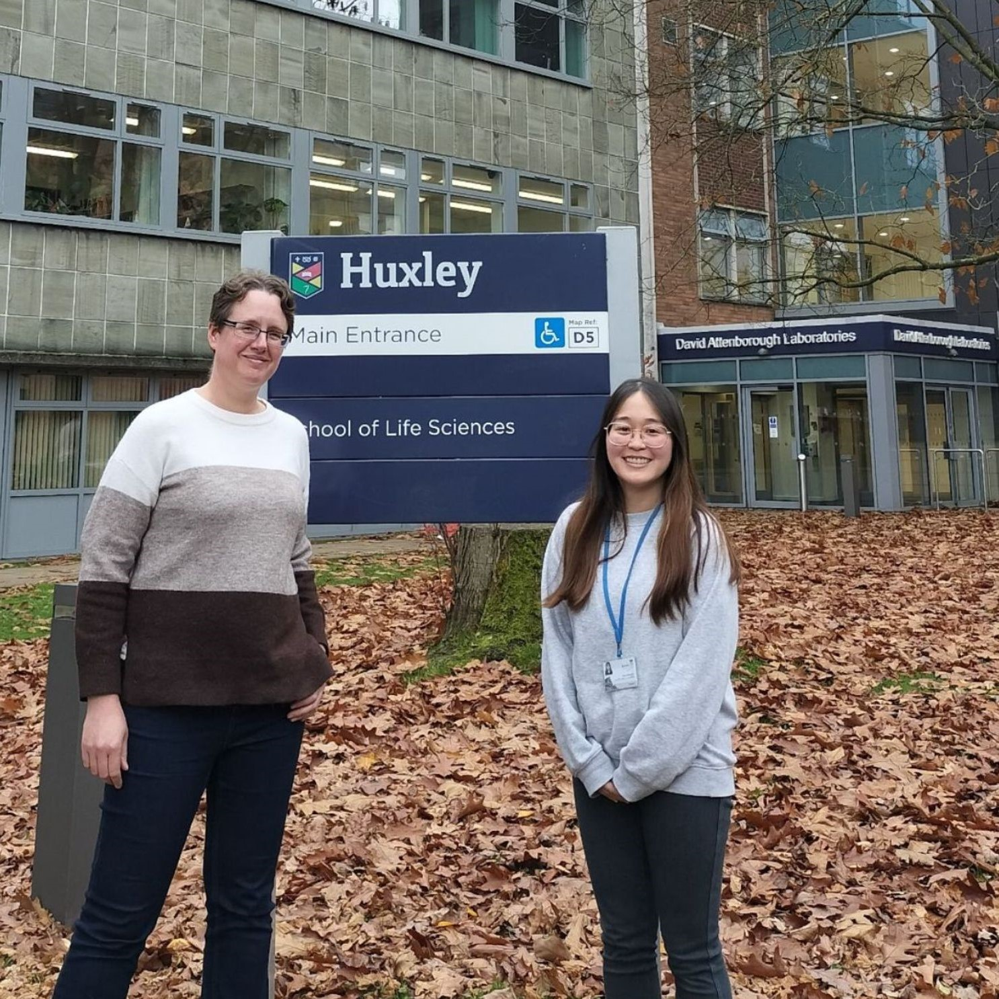
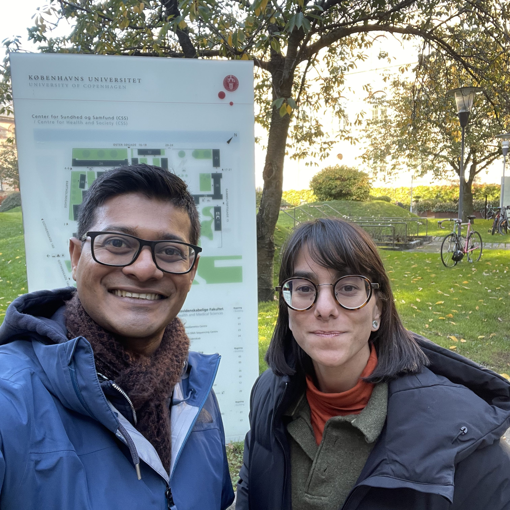
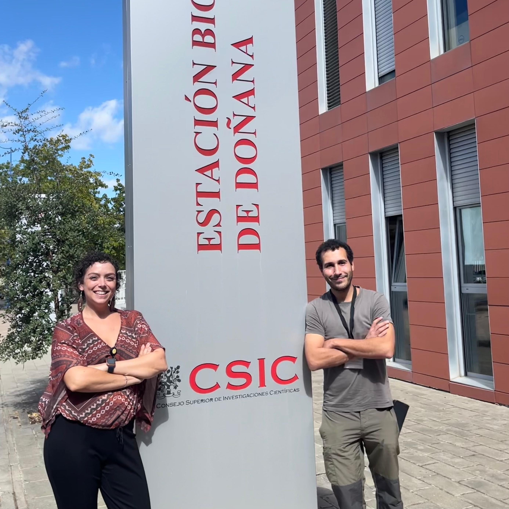
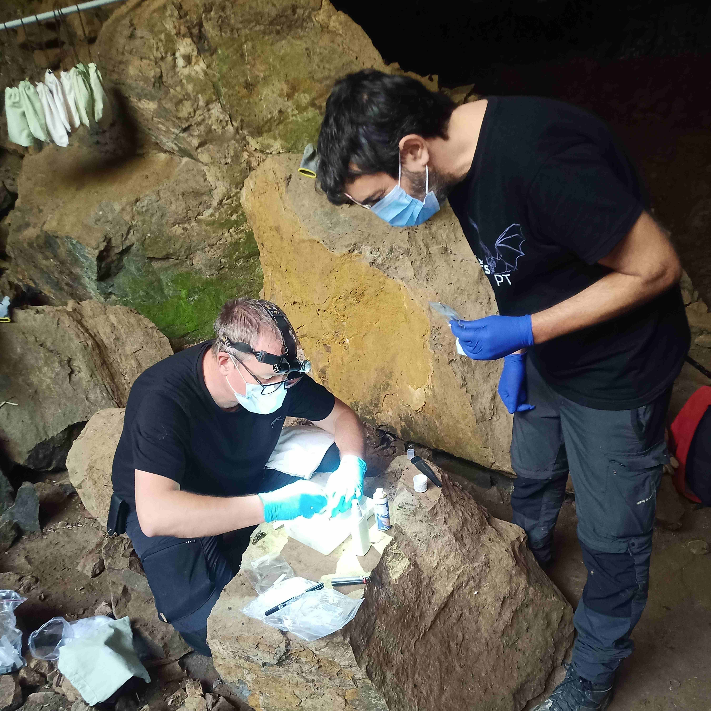
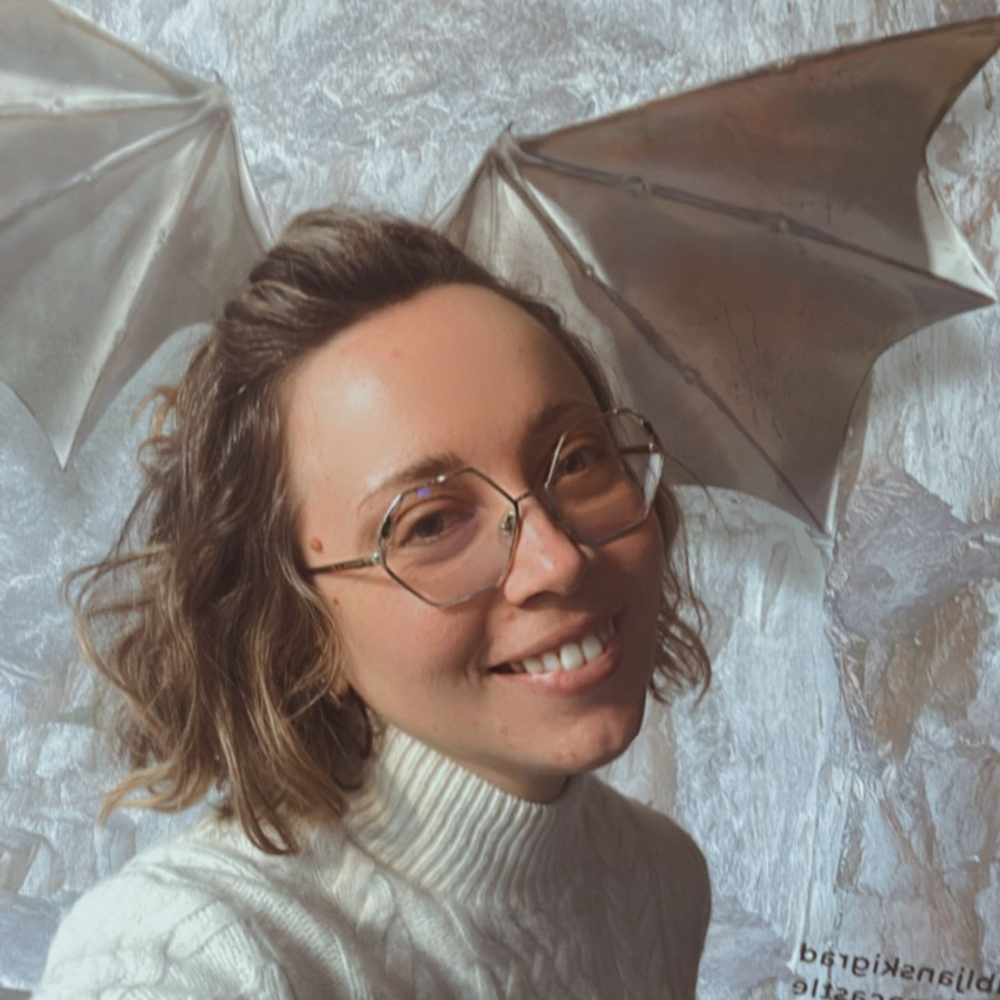

## STSMs in 2024

### Margarita Kazak 

Margarita Kazak from Lithuania went to visit Dr. Bruno Mathieu in France to train on the taxonomy and systematics of Culicoides (Diptera: Ceratopogonidae) biting midges including training on morphological and molecular methods and to expand her knowledge on biting midge seasonal trapping method selection. 

Your expectations?

> "Because of this internship, I was able not only to deepen my knowledge, but also to learn new methods to prepare the material for morphological identification; I was able to discover a new species in Lithuania in the material I had brought with me to the STSM, I was able to work with the Culicoides fauna of Asia and to visit several French farms where we carried out trapping of biting midges. Moreover, I was invited by dr. Bruno Mathieu to go to trainings in Vietnam as an expert on Culicoides; the trip to Vietnam and experience overall opened new carrier opportunities for me and gave me valuable experience."
   

### Carolina Chagas 

Carolina Chagas from Lithuania, went to visit Dr. Josue Martinew-de la Puente in Spain. She is co-leading the WG3 and wanted to discuss the next steps for it with Dr. Josue Martinez-de La Puente. During this visit they were able to start writing a review about the role of Culicoides in the transmission of Haemoproteus and Trypanosoma. This review is going to include several participants of the network and should be submitted soon. Additionally, they also discussed about the 2026 Summer School, to be focused on vectors and to be held in Spain. 

An anecdote?

> "The entire experience was great! I had the opportunity to interact more with such renowned researchers such as Dr. Josue Martinez-de La Puente, Dr. Martina Ferraguti and Dr. Jesus Veiga. It was also nice to see their research facilities and bring this knowledge back to my home institution. I also had the opportunity to meet Dr. Mikel Alexander González, which is an expert in Diptera insects. Everyone in the laboratory was very friendly and it is a place that I would love to come back!."
   

### Marta Garrigós 

Marta Garrigós from Spain went to visit Dr. Ellin Videvall in  Sweden, to analyze data of the microbiome of Culex pipiens mosquitoes exposed and unexposed to Plasmodium relictum. 

An anecdote?

> "I had the opportunity to attend a Swedish thesis defense. The PhD students made a theater parody of the person defending the thesis and the different people in the department, and I found it funny."
   

### Misa Shimizu 

Misa Schimizu from Lithuania visited Dr. Jenny Dunn, in the UK to conduct morphological and molecular identification of Haemoproteus in vultures. 

An anecdote?

> "I identified Haemoproteus parasites from vultures morphologically for the first time. STSM was also a nice opportunity to talk with researchers and students having different backgrounds at Keele University."
   

### Irène Hernández Caballero 

Irène Hernández Caballero from Spain went to visit Dr. Kasun Bodawatta in Denmark to analyze uropygialmicrobiome samples from house sparrows infected with avian malaria. 

An anecdote?

> "Dr. Bodawatta was very welcoming and thoughtful. One of the most memorable moments was when he brought me a croissant as a welcome gift, as I had told him I love pastries. I thought it was a very nice gesture and the best welcome. I also had the pleasure of attending a lab meeting and spending a few days doing field work with his group, which was a very valuable experience."
   

### Luca Ilahiane

Luca Ilahiane from Italy, went to visit Dr. Martina Ferraguti in Spain to perform sample screening for parasite occurrence in avian samples, collected as part of a broader study investigating the effects of urbanization on synanthropic and near-endemic species. 

Your expectations?

> "In just one month of stay, all 388 samples were fully screened for all parasites, and the infected ones were sequenced. This provided interesting new data on host-parasite relationships in heavily urbanized environments."
   

### Attila Sándor

Attila Sándor from Hungary went to visit the Bat Ecology Group of the Centre for Ecology, Evolution and Environmental Changes at the University of Lisbon, Portugal, to bridge research methodology and practical knowledge between two teams of bat researchers in order to set up a joint study in bat-malaria. 

Your expectations?

> "The results of the STSM are the jointly approved and enhanced set of highly standardized procedures for simultaneous data collection for the impact of hibernation (or lack of hibernation) on malaria-clearance in bent-winged bats, which will constitute the base for an experimental study in the near future. The techniques were tested and repeated in three successive setting at three different bent-winged bat colonies in N, C and SE Portugal (Tamar/Nabao, Mira Moura and Montemor-o-Novo), both at natural (caves), as well anthropogenic roosts (mine shafts). The participants from Portugal (2 persons from the University and 3 persons from local groups at Porto and Montemor) were familiarized with techniques of bat capture as well blood and ectoparasite collection intended for malaria surveys."
   

### Alexandra Corduneanu

Alexandra Corduneanu from Romania visited Alejandro Cabezas-Cruz, PhD Principal Investigator UMR BIPAR (INRAE, Anses, EnvA), Paris, France to analyze the microbiome of bats associated with their parasites. The outcomes of this visit will contribute to a deeper understanding of bat-associated vector-borne pathogens in French Giana and Romania, aiding in the development of effective surveillance and management strategies. By elucidating the complex interactions between bats and their vector-borne pathogens, this study aimed to mitigate the risks posed by these diseases to both wildlife and human populations. 

An anecdote?

> "During my time at UMR-BIPAR ANSES in Paris, I spent countless hours in the lab carefully analyzing samples collected from bats. One afternoon, while discussing preliminary results with colleagues, we detected an unexpected pathogen appearing across multiple samples—one we hadn’t initially set out to find. Was this pathogen just an incidental finding, or was it playing a larger role in bat-vector interactions than we had anticipated? We are putting together all the information to identify if really is something new or not."
  
