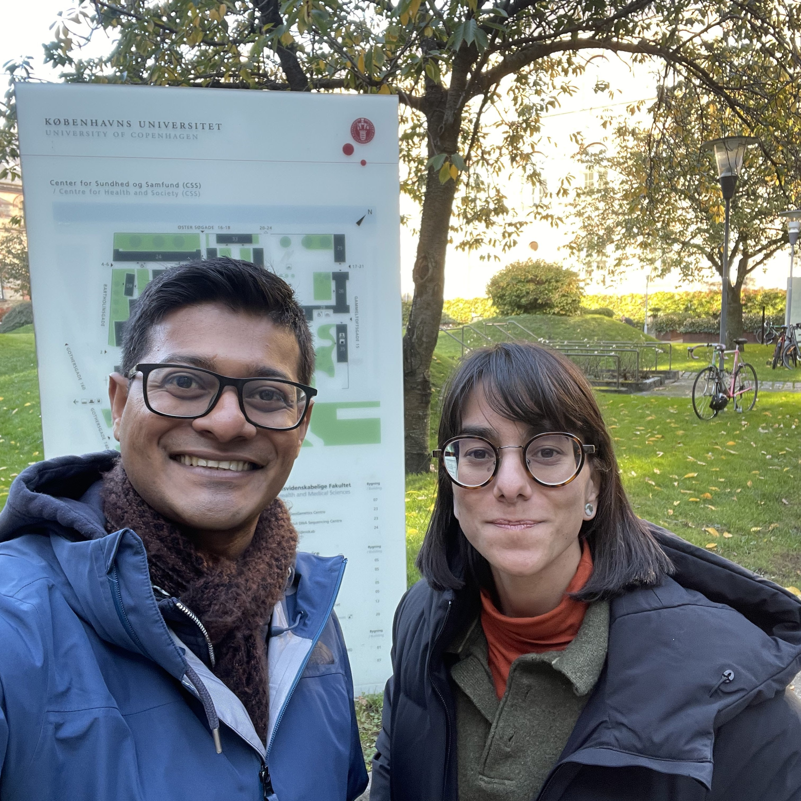
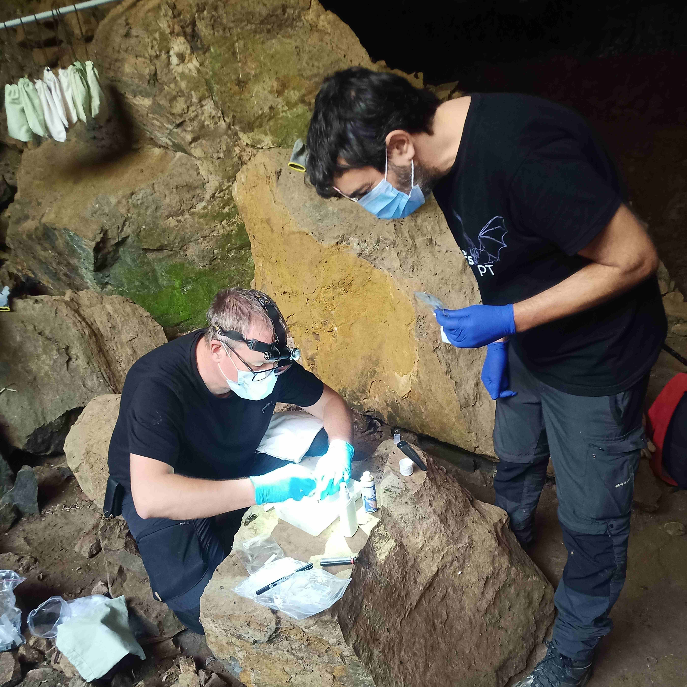

## STSMs in 2024

### Irène Hernández Caballero 

Irène Hernández Caballero from Spain went to visit Dr. Kasun Bodawatta in Denmark to analyze uropygialmicrobiome samples from house sparrows infected with avian malaria. 
 
An anecdote? 
Dr. Bodawatta was very welcoming and thoughtful. One of the most memorable moments was when he brought me a croissant as a welcome gift, as I had told him I love pastries. I thought it was a very nice gesture and the best welcome. I also had the pleasure of attending a lab meeting and spending a few days doing field work with his group, which was a very valuable experience.
---
 

### Luca Ilahiane

Luca Ilahiane from Italy, went to visit Dr. Martina Ferraguti in Spain to perform sample screening for parasite occurrence in avian samples, collected as part of a broader study investigating the effects of urbanization on synanthropic and near-endemic species. 
 
Your expectations? 
In just one month of stay, all 388 samples were fully screened for all parasites, and the infected ones were sequenced. This provided interesting new data on host-parasite relationships in heavily urbanized environments.
---
 

### Attila Sándor 

Attila Sándor from Hungary went to visit the Bat Ecology Group of the Centre for Ecology, Evolution and Environmental Changes at the University of Lisbon, Portugal, to bridge research methodology and practical knowledge between two teams of bat researchers in order to set up a joint study in bat-malaria. 
 
Your expectations? 
The results of the STSM are the jointly approved and enhanced set of highly standardized procedures for simultaneous data collection for the impact of hibernation (or lack of hibernation) on malaria-clearance in bent-winged bats, which will constitute the base for an experimental study in the near future. The techniques were tested and repeated in three successive setting at three different bent-winged bat colonies in N, C and SE Portugal (Tamar/Nabao, Mira Moura and Montemor-o-Novo), both at natural (caves), as well anthropogenic roosts (mine shafts). The participants from Portugal (2 persons from the University and 3 persons from local groups at Porto and Montemor) were familiarized with techniques of bat capture as well blood and ectoparasite collection intended for malaria surveys.
---
 

### Alexandra Corduneanu 

Alexandra Corduneanu from Romania visited Alejandro Cabezas-Cruz, PhD Principal Investigator UMR BIPAR (INRAE, Anses, EnvA), Paris, France to analyze the microbiome of bats associated with their parasites. The outcomes of this visit will contribute to a deeper understanding of bat-associated vector-borne pathogens in French Giana and Romania, aiding in the development of effective surveillance and management strategies. By elucidating the complex interactions between bats and their vector-borne pathogens, this study aimed to mitigate the risks posed by these diseases to both wildlife and human populations. 
 
An anecdote? 
During my time at UMR-BIPAR ANSES in Paris, I spent countless hours in the lab carefully analyzing samples collected from bats. One afternoon, while discussing preliminary results with colleagues, we detected an unexpected pathogen appearing across multiple samples—one we hadn’t initially set out to find. Was this pathogen just an incidental finding, or was it playing a larger role in bat-vector interactions than we had anticipated? We are putting together all the information to identify if really is something new or not.

